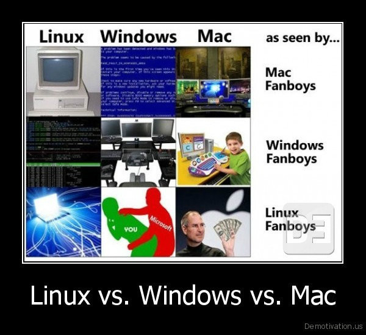
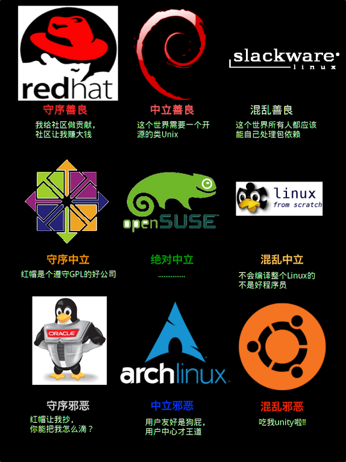
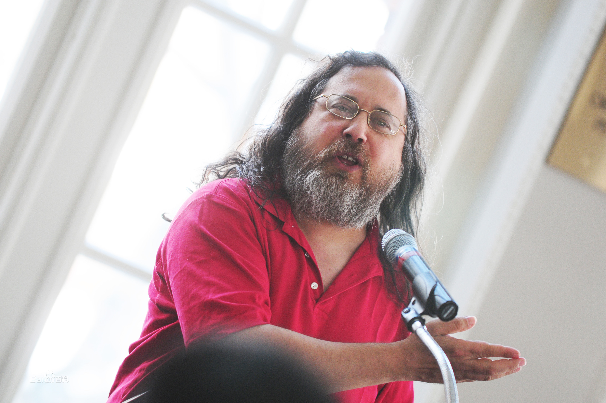

> 一张有趣的图片，大概意思就是linux**免费开源工作效率高**，windows。。。mac烧钱。。（其实讲道理mac挺好的，我一直想换个mac玩玩）

linux历史其实相当的复杂，简单几句是讲不完的。建议大家还是多去看看维基。下面只是简单的罗列。

- **严格来讲，术语Linux只表示操作系统内核本身，但通常采用Linux内核来表达该意思。Linux则常用来指基于Linux内核的完整操作系统，包括GUI组件和许多其他实用工具。**　
- **Linux最初是作为支持英特尔x86架构的个人电脑的一个自由操作系统。目前Linux已经被移植到更多的计算机硬件平台，远远超出其他任何操作系统。Linux可以运行在服务器和其他大型平台之上，如大型主机和超级计算机。Linux也广泛应用在嵌入式系统上，如手机（Mobile Phone）、平板电脑（Tablet）、路由器（Router）、电视（TV）和电子游戏机等。在移动设备上广泛使用的Android操作系统就是创建在Linux内核之上。**
- **linux内核完全是开源的，你可以找到它的所有代码，[官方网站](https://www.kernel.org/)，[github仓库](https://github.com/torvalds/linux)（科协上上任主席樊超学长就是做linux内核的）**

### 关于发行版本

前面说过linux只是一堆内核代码，并不是真正的可以用来使用的操作系统。于是各个公司或者是组织或者是个人开始定制内核(这个如果有时间会讲**编译内核**，简单来说就是内核有很多功能，编译内核就可以让我们自己挑选自己想要的功能，那些不想要的就不编译，据说高手都是自己编译内核。。。)，他们定制内核，然后配上软件，然后就可以开始发行。出名的像**redhat**的**redhat**，**Canonical**的ubuntu。　

主要的发行版本有两大阵营**debian系**和**红帽系**
 
 个人pc上，我知道的几个人用的，比如我是archlinux，王家豪用的opensuse，林恩怜学姐用的arch，陈润青和樊总用的fedora。。各个发行版本的区别其实还是有的，以后会提到，像包管理器之类。。

### 两个重要人物

> linus，linux的爸爸
>　[度娘百科](http://baike.baidu.com/view/117611.htm?fromtitle=linus&fromid=400810&type=syn)

> stallman，GNU计划发起人
> [度娘百科](http://baike.baidu.com/subview/117581/117581.htm)

### 关于桌面环境

服务器一般终端就够了，但是个人pc还是需要一个好用的gui环境的。桌面环境还是分好多种，各个的特点和发展也是不一样。

下面是一些链接，供大家用来参考。对于一些概念看不懂也没有关系，只要脑海中留一个印象就行，随着你的学习就会逐渐了解的。

[度娘百科linux](http://baike.baidu.com/view/1634.htm)
[度娘百科unix](http://baike.baidu.com/view/8095.htm)
[度娘百科类unix](http://baike.baidu.com/view/1734582.htm)
[度娘百科GPL协议](http://baike.baidu.com/view/130692.htm)
[度娘百科posix标准](http://baike.baidu.com/view/209573.htm)
[linux历史](http://blog.csdn.net/dycwahaha/article/details/2300594)
[linux历史](http://blog.csdn.net/xiazdong/article/details/7835219)
[林恩怜学姐的unix程序设计](https://github.com/AoEiuV020/linux)

一些有趣的书
[若为自由故](https://book.douban.com/subject/26314527/)
[just for fun](https://book.douban.com/subject/25930025/)